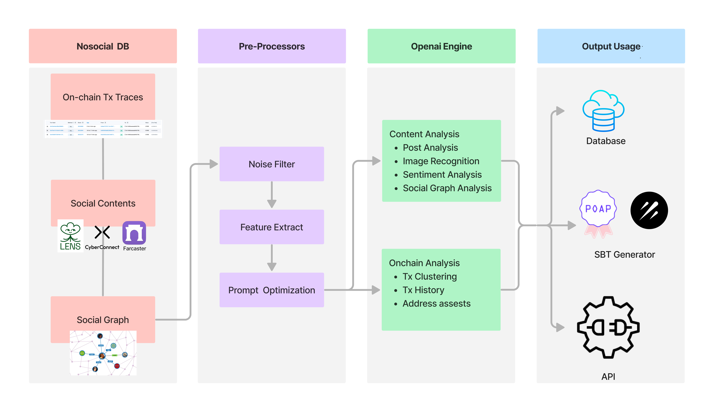

# Nosocial AI Analyzer

The AI Analyzer in Nosocial utilizes cutting-edge technology provided by OpenAI engine to analyze and interpret user on-chain and social behaviors. By extracting insights from such behavioral analysis, Nosocial can effectively obtain user characteristics, generate comprehensive user profiles, and leverage them for various other lucrative business purposes.

## Table of Contents

-   [Project Structure](#project-structure)
-   [Contributions](#contributions)
-   [License](#license)
-   [Credits](#credits)
-   [Contact](#contact)
-   [Additional Information](#additional-information)

## Project Structure

Here are the workflow for ai-analyzer.

## Contributions

We welcome contributions from the community! If you have any enhancements, bug fixes, or issues, please do send us a pull request or open an issue on the Github page.

When submitting a pull request, please follow these guidelines:

-   The title and content of the pull request should clearly indicate the purpose of the changes.
-   The code should be formatted and consistent with the existing codebase.

## License

This project is licensed under the Apache License 2.0. For more details, please refer to the LICENSE file.

## Credits

N/A

## Contact

Please feel free to contact us at nosociallabs@gmail.com with any questions or feedback directly through github issues.

## Additional Information

N/A
